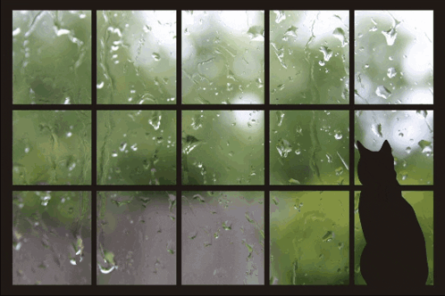

<!-- Heading -->
<h3 align="left">Hi there! I'm Tatyana </h3>

<!-- code gif-->

 
  <!-- GitHub section -->

### 🦕 About me:

  ★ I am finishing my third year at Novosibirsk State University.  
  ★ I am fond of low-level programming in C and C++.  
  ★ I love mathematics and physics.  
  ★ I'm improving my English.  

### Languages and tools
&nbsp;
&nbsp;
&nbsp;
&nbsp;
&nbsp;
&nbsp;
&nbsp;
&nbsp;
&nbsp;

 ##  My GitHub Stats 

<!-- THE END -->
